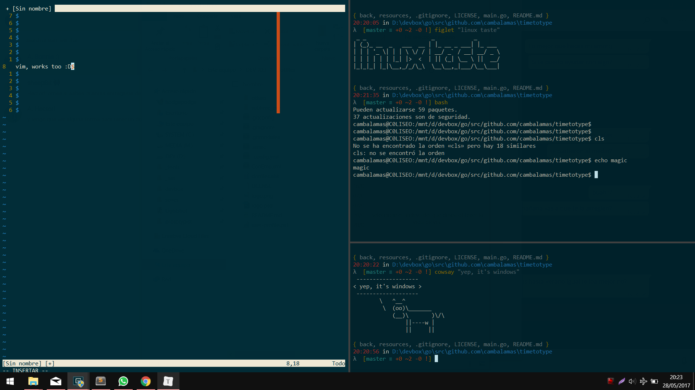

# Windows Enviroment.

<p align="center">  </p>

## Install.

***Read the `winux.ps1` file before execute anything.***

***I do not take responsibility for unwanted changes.***

> ***However, in time I will try to elaborate a detailed description of all this.***

```git
git clone https://github.com/cambalamas/winux $env:userprofile\.dotfiles
```
```powershell
gc $env:userprofile\.dotfiles\winux.ps1 | iex
```

## Preview.

<p align="center">  </p>

