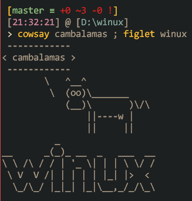

1. Download repo as zip and store it on a fix place.
2. Run (*Read it before*) `Install.ps1`
3. Enjoy :D

> The install file, links this config files with the system config files.
Also install `choco` (app manager) and `scoop` (tools manager) and with it,
my favourites apps, feel free to change it to your alternatives
(use `choco search` and `scoop search` to find your apps and tools) :D
