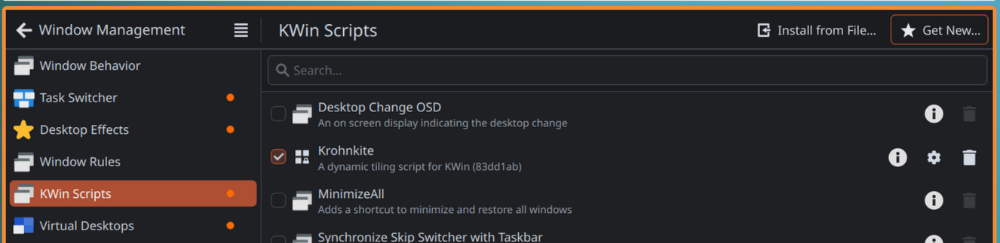
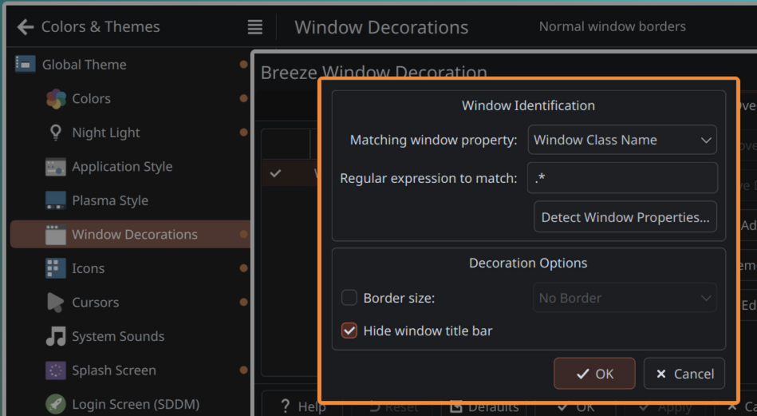

# Arch Linux Notes

## Avoid app autostart

- https://bbs.archlinux.org/viewtopic.php?pid=2169885#p2169885


```shell
rm ~/.config/autostart/electron.desktop              # get rid of the actual autostart
touch ~/.config/autostart/electron.desktop           # cretate a file to block the space
sudo chattr +i ~/.config/autostart/electron.desktop  # avoid any app to modify the file
```

## Tiling on KDE

> https://github.com/esjeon/krohnkite

### Install

- Option 1: Pacman
    ```shell
    sudo paru -S kwin-scripts-krohnkite-git
    ```
- Option 2: Install Krohnkite from KWin Scripts UI
    

### Config

1. Go to `Window Management > Window Rules` and *Import* config from `kde/win_rules.kwinrule`

2. Go to `Keyboard > Shortcuts` and *Import* config from `kde/shortcuts.kksrc`

3. The install script will link a custom KDE globals with border colors In RGB
    ```cfg
    frame=240,140,60
    inactiveFrame=60,140,240
    ```
4. Go to `Colors & Themes > Window Decorations > [edit] Breeze` and apply below config
    

